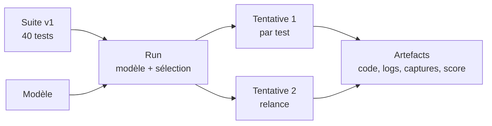

# PRD — model-bench

2026-09-23 · Mike Codeur

Version visuelle : https://claude.ai/code/artifact/6020989e-3861-4310-8910-a666468fc5d8

## Contexte

model-bench sert à produire des benchs visuels maison pour les vidéos YouTube d'annonce de modèles, en complément des benchs officiels.

Aujourd'hui, une vidéo d'annonce reprend surtout les specs, les prix et les benchmarks publiés par l'éditeur. C'est léger et identique à ce que font les autres chaînes. L'objectif est de montrer à l'audience ce que le modèle produit réellement : une scène 3D, une landing page, une simulation, un jeu.

État actuel du repo (commit `a11dfb5`) :

- `benchmarks.json` : 40 briefs (14 3D, 9 frontend, 9 simulations/math/algo, 4 jeux, 4 code agentique), avec critères d'acceptation et type de capture.
- `scripts/prepare-run.py` : génère un workspace par test (`PROMPT.md`, `benchmark.json`) et un `run.json`, filtrable par catégorie ou IDs.
- `scripts/validate-suite.py` : valide le catalogue.
- Aucun adapter de modèle, aucun stockage des résultats, aucune visualisation.

## Objectifs

Le produit doit permettre de lancer n'importe quel sous-ensemble de la batterie sur n'importe quel modèle, autant de fois que voulu, et d'en garder une trace comparable.

**Objectifs**

1. Maintenir une batterie de tests propre, versionnée, quelle que soit sa source (briefs maison ou repos officiels).
2. Exécuter tout ou partie de la batterie sur un modèle donné (Opus 5.5 aujourd'hui, Codex demain, Kimi après-demain).
3. Relancer un test déjà passé sans écraser le résultat précédent.
4. Sauvegarder chaque résultat de façon durable, sans faire exploser la taille du repo.
5. (Partie 2) Visualiser et comparer les résultats pour les montrer en vidéo.

**Non-objectifs**

- Remplacer les benchmarks officiels ou produire un classement scientifique.
- Copier des prompts sous licence non commerciale (CC-BY-NC-SA) : seules les idées génériques sont reprises.
- Corriger à la main le code d'un modèle pendant un run.

## Concepts clés

Cinq objets structurent tout le produit : un Run exécute une sélection de Tests d'une Suite sur un Modèle, et chaque exécution d'un test produit une Tentative.

| Objet | Définition | Exemple |
| --- | --- | --- |
| Suite | Ensemble versionné de tests, avec un contrat commun (livrables, viewports, métriques, scoring) | `model-bench v1`, 40 tests |
| Test | Un brief + critères d'acceptation + type de capture + provenance | `3d-06-black-hole-lensing` |
| Modèle | Identifiant exact du modèle + fournisseur + outil d'exécution + réglages (effort, reasoning) | Kimi K2 via OpenCode, GPT-5 via Codex, Opus 5.5 via Claude Code |
| Run | Une session de bench : un modèle, une version de suite, une sélection de tests, une date | Opus 5.5, 23/09, 20 tests sur 40 |
| Tentative | Une exécution d'un test dans un run ; un test peut en avoir plusieurs | `3d-06` tentative 1 et tentative 2 |



Le scénario de référence : sur un modèle donné (Opus, GPT, Kimi…), lancer 20 des 40 tests, puis relancer une dizaine de ces 20. Le résultat attendu est un run contenant 20 tests, dont 10 avec deux tentatives, toutes conservées.

Règle de référence : une relance crée une nouvelle tentative dans le même run, jamais un écrasement. La tentative affichée par défaut est la plus récente, sauf sélection manuelle.

## Partie 1 — Principe v1

La v1 tient en deux fichiers de config, une commande et un dossier par tentative ; tout le reste s'ajoute ensuite sans casser l'existant.

Le runner ne connaît aucun fournisseur. Il lance une commande shell déclarée dans `models.json`, rien de plus. Claude, GPT, Kimi, Gemini, GLM, Qwen, DeepSeek ou un modèle local via Ollama : tous passent par le même chemin, sans code spécifique.

## Partie 1 — La batterie de tests

`benchmarks.json` reste tel quel : ajouter un test, c'est ajouter une entrée.

- Sources : `original`, `video-reconstructed`, ou `external` avec `source_url` (licence vérifiée à l'import, usage commercial requis).
- Le validateur vérifie les IDs uniques et les champs requis. La contrainte « exactement 40 tests » saute.

## Partie 1 — Déclarer un modèle

Un nouveau modèle = une entrée dans `models.json` : un nom, une commande avec `{prompt}`, et un prix optionnel.

```json
{
  "kimi-k2":  { "label": "Kimi K2",  "command": "opencode run --model openrouter/moonshotai/kimi-k2 {prompt}", "price": { "input": 0.6, "output": 2.5 } },
  "gpt-5":    { "label": "GPT-5",    "command": "codex exec --full-auto {prompt}" },
  "gemini":   { "label": "Gemini",   "command": "gemini --yolo -p {prompt}" },
  "glm":      { "label": "GLM",      "command": "opencode run --model openrouter/z-ai/glm {prompt}" },
  "opus-5-5": { "label": "Opus 5.5", "command": "claude -p --model claude-opus-5-5 --dangerously-skip-permissions {prompt}" }
}
```

Model IDs, prix et flags sont des exemples, à vérifier à l'implémentation. `price` est en USD par million de tokens.

## Partie 1 — Lancer un run

Une seule commande couvre le premier lancement, la sélection et les relances.

```bash
bench run --model kimi-k2                       # toute la suite, nouveau run
bench run --model kimi-k2 --category 3d         # une catégorie
bench run --model kimi-k2 --ids 3d-06,web-01    # quelques tests
bench run --model kimi-k2 --run 2026-09-23-a --ids 3d-06   # relance = nouvelle tentative
```

Pour chaque test, le runner :

1. crée un workspace vide avec `PROMPT.md` ;
2. exécute la commande du modèle dans ce workspace, avec un timeout global (30 min par défaut) ;
3. enregistre sortie, durée et code de sortie ;
4. supprime `node_modules`, `.next`, `dist` et les caches ;
5. écrit `attempt.json`.

Règles d'équité : même prompt, même timeout, workspace neuf, aucune intervention humaine pendant une tentative.

## Partie 1 — Ce qui est sauvegardé

Tout est en JSON, dans un dossier par tentative ; pas de base de données en v1.

```
results/<model>/<run>/<test>/attempt-<n>/
  attempt.json
  output.log
  workspace/        # code produit, sans dépendances
```

```json
{
  "model": "kimi-k2", "test": "3d-06-black-hole-lensing", "run": "2026-09-23-a", "attempt": 2,
  "started_at": "2026-09-23T14:02:11Z", "duration_s": 412, "exit_code": 0, "status": "ok",
  "tokens": { "input": null, "output": null },
  "cost_usd": null,
  "score": null,
  "notes": ""
}
```

- Une valeur inconnue vaut `null`, jamais `0`.
- Le coût vaut tokens × `price` quand les deux sont connus.
- Extensible : on ajoute un champ quand on en a besoin ; les lecteurs ignorent les champs qu'ils ne connaissent pas.
- `results/` reste local et hors Git en v1.

## Partie 1 — Extensions prévues (hors v1)

Chaque extension ajoute un champ ou une étape, sans refonte.

| Extension | Ce qu'elle ajoute | Déclencheur |
| --- | --- | --- |
| Parser par CLI | tokens et coût réels lus dans la sortie | quand on veut comparer les coûts |
| Captures Playwright | screenshots et vidéo de 5 s dans `captures/` | avant la première vidéo |
| Delivery gate | install, build et démarrage en ok ou ko | idem |
| Scoring | note manuelle ou juge IA dans `score` | après 2 modèles comparés |
| Stockage distant | copie de `results/` vers S3 ou R2 | quand le disque local gêne |
| Index SQLite | base générée depuis les JSON | seulement si la visualisation rame |

## Partie 2 — Visualiser (plus tard)

La partie 2 lit uniquement les JSON et captures de la partie 1 ; elle ne déclenche aucun run. Le cadrage détaillé viendra dans un second PRD.

Vues pressenties :

- **Par modèle** : liste des runs, taux de delivery gate, score moyen par catégorie.
- **Par test** : galerie côte à côte des modèles sur un même test, avec toutes les tentatives.
- **Duel** : modèle A contre modèle B sur les tests communs, pour un segment de vidéo.
- **Mode aveugle** : captures sans nom de modèle, pour noter avant de révéler.
- **Export vidéo** : grille ou montage prêt à importer dans le logiciel de montage.

Contrainte posée dès la partie 1 : le format de `run.json` et `attempt.json` doit suffire à construire ces vues sans relire les logs.

## Questions ouvertes

- [ ] Exécution en local sur le Mac, ou dans un conteneur Docker pour isoler les agents en mode sans permission ?
- [ ] Langage du runner : garder Python, ou passer en TypeScript pour partager les types avec la visualisation ?
- [ ] Quels repos officiels importer en premier ?

## Jalons

La v1 est finie quand le même lot de tests tourne sur deux modèles de fournisseurs différents, sans une ligne de code spécifique à l'un ou l'autre.

| Jalon | Contenu | Critère de fin |
| --- | --- | --- |
| M1 — Runner v1 | `models.json`, `bench run`, `attempt.json` | 3 tests lancés sur 2 modèles de fournisseurs différents, relance incluse |
| M2 — Captures | Playwright et delivery gate | captures exploitables dans une vidéo |
| M3 — Visualisation | PRD dédié, puis galerie | hors partie 1 |
